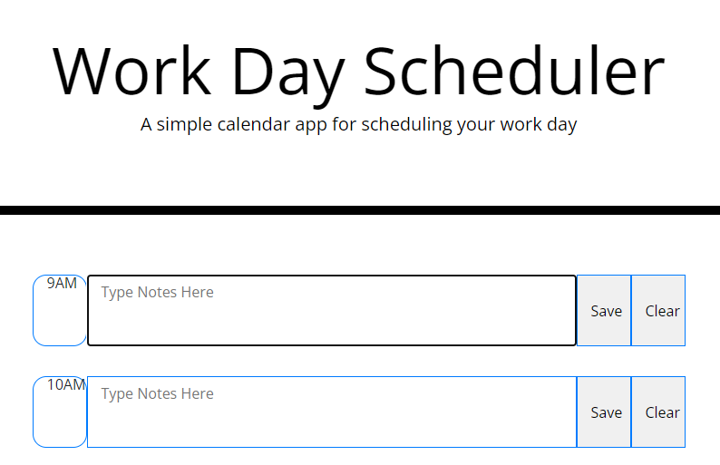

# Work Day Scheduler

## Purpose
This project is designed give a daily planner that can create a schedule and allow the user to add important events to the planner to manage their time effectively.

## Why It Doesn't Work
While I feel confident in my ability to use Bootstrap, I couldn't get the functionality in script.js to work. I referred back to the module and my 
```
$(document).ready(function () {
    $(".saveBtn").click(function () { ...
```
does not show anything in the console log of developer tools. I am out of time but I will be revisiting this project again to figure out what I'm doing wrong.

## Built With
-HTML
-CSS
-JavaScript
-jQuery
-Bootstrap
-sad sad attempt at moment.js

## Link to Deployed Application
[Password Generator] (https://mikak02.github.io/week5Challenge/)

## Screenshot
